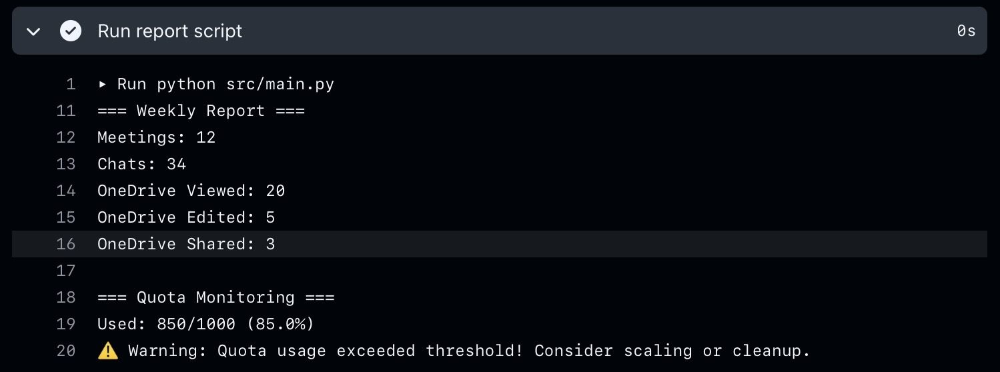

# Workflow Automation Demo


A demo project showcasing **Python + GitHub Actions** for automated reporting and quota monitoring.  
This repository is designed as a portfolio example to demonstrate workflow automation, error handling, and reporting logic.

---

## 🚀 Features
- **Automated Weekly Report**  
  - Runs every Monday 09:00 UTC via GitHub Actions  
  - Can also be triggered manually  

- **Python Reporting Script**  
  - Generates a weekly summary (Meetings, Chats, OneDrive activity)  
  - Includes quota monitoring with configurable threshold  
  - Built-in error handling and fallback logic  

- **Sample Data**  
  - `src/sample_data.json` provides demo values for report output  
  - Safe to publish (no secrets included)  

- **Environment Variables**  
  - `.env.example` shows how to override quota threshold  
  - Real `.env` is ignored by `.gitignore`  

---

## 📂 Project Structure
```text
.github/workflows/report.yml   # GitHub Actions workflow
src/main.py                    # Main Python script
src/sample_data.json           # Demo data for reporting
.env.example                   # Example environment variables
.gitignore                     # Ignore sensitive/local files
README.md                      # Project documentation
```

---

## 🖥️ Example Output

=== Weekly Report === Meetings: 12 Chats: 34 OneDrive Viewed: 20 OneDrive Edited: 5 OneDrive Shared: 3
=== Quota Monitoring === Used: 850/1000 (85.0%) ⚠️ Warning: Quota usage exceeded threshold! Consider scaling or cleanup.

---

## 📸 Screenshots
Below is an example of the workflow run in GitHub Actions, showing the **Run report script** step expanded with the generated report and quota monitoring output:



---

## ⚙️ How to Run
1. Fork or clone this repository  
2. (Optional) Create `.env` file based on `.env.example`  
3. Push changes to trigger workflow, or run manually in GitHub Actions  

---

## 📜 License
MIT License – feel free to use this demo as a reference.
